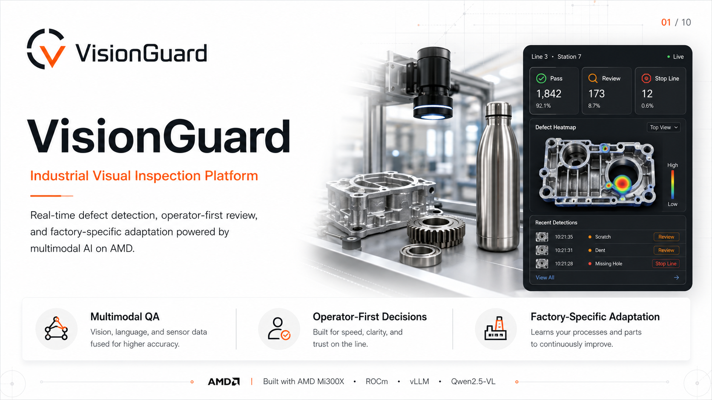
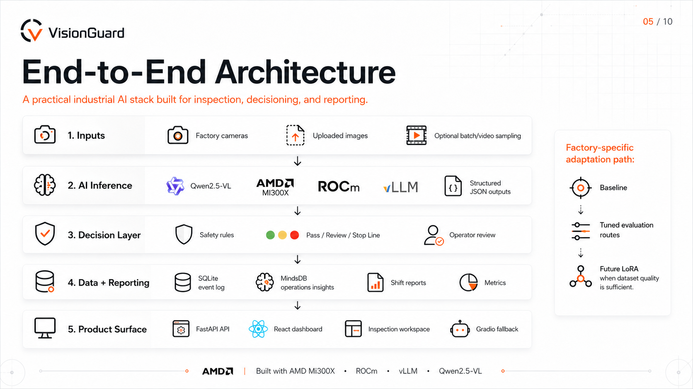
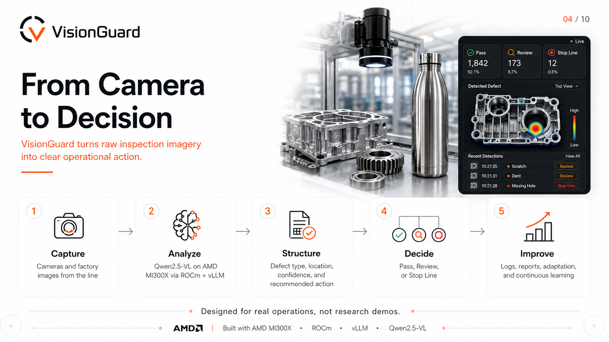

# VisionGuard — Industrial Visual AI on AMD MI300X

VisionGuard turns factory camera images into reliable QA decisions — **PASS**, **REVIEW**, or **STOP_LINE** — using multimodal AI served on **AMD MI300X** with **ROCm** and **vLLM**.

`AMD MI300X · ROCm · vLLM · Qwen2.5-VL · FastAPI · React · SQLite · Factory Adaptation`

VisionGuard is a general industrial visual inspection platform. Bottle manufacturing is our real-world proof use case. NanoDefects is our factory-specific adaptation case study.



## Quick Links

- Live Demo: https://vision-amd.vercel.app
- Demo Video: `<add link>`
- Pitch Deck: [VisionGuard platform deck](https://drive.google.com/file/d/1KnJcfHVO2jEsvbkt9h3P1sthmIFduesJ/view?usp=sharing)
- Technical Walkthrough: `<add link>`
- Proof Artifacts: [`docs/proof/`](docs/proof/)

## 30-Second Summary

VisionGuard is an operator-assisted industrial inspection system for turning product images into factory decisions. It accepts camera frames or uploaded images, sends them through Qwen2.5-VL served by vLLM on AMD MI300X, returns structured inspection JSON, and routes the result into PASS, REVIEW, or STOP_LINE. The product includes a premium React inspection console, FastAPI backend, event logging, shift reports, operations alerts, and runtime visibility. AMD matters because the system is designed around high-throughput multimodal inference on MI300X with ROCm. NanoDefects proves how a factory-specific dataset can be imported, evaluated, and used to reduce false PASS risk before future adapter training. The current system is demo-ready for operator-assisted QA; production conveyor auto-release and trained LoRA adapters are future roadmap items.

## The Problem

Factory quality inspection is still difficult to scale.

- Manual inspection is inconsistent across operators, shifts, lighting, and product variants.
- Subtle defects on reflective materials are hard to catch reliably.
- Traditional vision systems can be rigid, expensive to reconfigure, and brittle when products change.
- Factories need decisions and workflows, not only model predictions.
- A false PASS is the highest-risk failure mode because a defective product can leave the line unnoticed.

Industrial teams need an inspection system that can reason about defects, explain likely causes, route actions, and adapt to each factory’s product line over time.

## The Solution

VisionGuard is an end-to-end industrial visual QA platform.

It combines:

- image or factory camera input
- multimodal defect reasoning
- structured JSON inspection output
- PASS / REVIEW / STOP_LINE routing
- visual evidence and approximate defect regions
- event logging and inspection history
- shift reports and operations alerts
- factory-specific dataset onboarding and adaptation workflow

The goal is not to be a narrow bottle detector. The goal is a general inspection layer that can start zero-shot, then become more factory-specific through real customer data.

## What VisionGuard Does

| Capability | What it does |
| --- | --- |
| Live Inspection | Runs product images through Qwen-VL using the AMD/vLLM runtime when available |
| Operator Decisions | Converts model output into PASS, REVIEW, or STOP_LINE actions |
| Evidence Regions | Shows approximate defect regions when localization is available |
| Reporting | Logs inspections, generates shift reports, and surfaces operations alerts |
| Runtime Visibility | Shows latency, endpoint state, model route, and AMD runtime metadata |
| Factory Adaptation | Provides dataset onboarding, readiness analysis, model registry, and future adapter/LoRA path |

## Architecture



```text
Factory Camera / Image Upload
        ↓
React Inspection Workspace
        ↓
FastAPI Backend
        ↓
Qwen2.5-VL via vLLM
        ↓
AMD MI300X + ROCm
        ↓
Structured Inspection JSON
        ↓
Safety / Routing Layer
        ↓
PASS / REVIEW / STOP_LINE
        ↓
SQLite Events + Reports + Adaptation Studio
```

| Layer | Role |
| --- | --- |
| Frontend | React/Vite product shell with landing, dashboard, inspection, reports, settings, and adaptation pages |
| API layer | FastAPI wrapper exposing inspection, reporting, metrics, health, and adaptation endpoints |
| Model serving | OpenAI-compatible vLLM endpoint serving Qwen2.5-VL |
| Safety/routing layer | Applies false-PASS safeguards, route metadata, PASS verification, and operational action mapping |
| Data/reporting layer | SQLite-backed event store, metrics, report generation, and operations alerts |
| Adaptation layer | Dataset intake, readiness reports, model registry, routing metadata, and feedback loop concept |

## AMD Stack

VisionGuard is designed around the AMD inference stack:

| Component | Role in VisionGuard |
| --- | --- |
| AMD MI300X | GPU compute for multimodal inference |
| ROCm | AMD acceleration and runtime layer |
| vLLM | Model serving layer with OpenAI-compatible `/v1/chat/completions` API |
| Qwen2.5-VL-7B-Instruct | Multimodal visual reasoning model for defect inspection |

This matters for industrial inspection because factories need low-latency, repeatable inference that can be integrated into real operations software. VisionGuard exposes runtime status, model name, endpoint state, latency, and route metadata so the demo remains truthful about whether inference is live, demo, or offline.

## Live Demo Flow



Recommended judge flow:

1. Open the landing page and dashboard.
2. Run a clean product inspection.
3. Run a defective product inspection.
4. Review the event log.
5. Open reports and operations alerts.
6. Open Factory Adaptation Studio.
7. Select a model route such as Base VisionGuard, PCB Adapter v1, or NanoDefects Bottle QA.

Expected behavior:

- clean product → `PASS`
- subtle or uncertain defect → `REVIEW` / `ALERT_OPERATOR`
- severe structural defect → `STOP_LINE`
- reports and dashboard metrics update after scans

## NanoDefects Case Study

NanoDefects is a small real-world dataset collected from our own stainless-steel bottle factory. It is used as a factory-specific adaptation case study, not as a claimed trained LoRA model.

The dataset contains real QA issues such as dents, impact pits, scratches, coating damage, shoulder deformation, base defects, internal dents, and reflection-based surface deformation.

### Dataset Policy

- Total collected images: `50`
- Raw unmarked evaluation images: `26`
- Annotated reference-only images excluded from evaluation: `24`
- Raw-only evaluation is used for truthful model testing.
- Annotated/circled images are retained only as label references, not model evidence.

This split matters because using marked images as model input would inflate results and fail on real factory images.

### Current Raw-Only Evaluation

| Metric | Result |
| --- | ---: |
| Raw images | 26 |
| Annotated reference-only images excluded | 24 |
| Generic baseline false PASS | 13 |
| Safe mode false PASS | 0 |
| Balanced mode false PASS | 0 |
| Balanced clean PASS accuracy | 83.33% |
| Defect recall | 100% |

This is not a fake LoRA claim. It is the evaluation and safety layer before future factory-specific adapter training.

NanoDefects currently demonstrates a tuned evaluation route:

```text
NanoDefects Bottle QA — Evaluation Route
Status: baseline evaluated
Adapter training: pending
Recommended mode: operator-assisted QA
```

The next production step is collecting a more balanced raw dataset before training factory-specific adapters.

## Current Status

| Area | Status |
| --- | --- |
| Live AMD inference | Working when the vLLM tunnel is active |
| React frontend | Ready |
| FastAPI backend | Ready |
| Gradio fallback | Available |
| SQLite event logging | Ready |
| Reports and operations alerts | Ready |
| NanoDefects raw evaluation | Ready |
| Factory Adaptation Studio | Ready as an onboarding/evaluation workflow |
| LoRA / Adapter training | Future scope |
| Production conveyor deployment | Future scope |

## Results / Proof

Proof artifacts are stored in [`docs/proof/`](docs/proof/).

Important proof categories:

- vLLM model endpoint proof
- health and runtime proof
- live smoke outputs
- frontend screenshots
- event log and report proof
- NanoDefects raw baseline proof
- NanoDefects raw vs tuned proof
- Gradio fallback proof

Key NanoDefects files:

- [`docs/proof/nano-defects-raw-baseline.json`](docs/proof/nano-defects-raw-baseline.json)
- [`docs/proof/nano-defects-raw-baseline.md`](docs/proof/nano-defects-raw-baseline.md)
- [`docs/proof/nano-defects-raw-vs-tuned.json`](docs/proof/nano-defects-raw-vs-tuned.json)
- [`docs/proof/nano-defects-raw-vs-tuned.md`](docs/proof/nano-defects-raw-vs-tuned.md)

## How to Run

### 1. Install Backend Dependencies

```bash
python3 -m venv .venv
source .venv/bin/activate
pip install -r requirements.txt
```

### 2. Install and Build Frontend

```bash
cd frontend
npm install
npm run build
cd ..
```

### 3. Run FastAPI in Demo Mode

```bash
DEMO_MODE=true \
SQLITE_DB_PATH=/tmp/visionguard.db \
python -m uvicorn api:app --host 127.0.0.1 --port 8013
```

Open:

```text
http://127.0.0.1:8013
```

### 4. Run with AMD MI300X / vLLM

Start or tunnel the vLLM endpoint, then set:

```bash
export VLLM_URL=http://localhost:8000/v1/chat/completions
export MODEL_NAME=Qwen/Qwen2.5-VL-7B-Instruct
export DEMO_MODE=false
export SQLITE_DB_PATH=/tmp/visionguard_live.db
```

Run:

```bash
python -m uvicorn api:app --host 127.0.0.1 --port 8013
```

Health check:

```bash
curl http://127.0.0.1:8013/health
```

Expected live state when the vLLM tunnel is active:

```json
{
  "api": "online",
  "demo_mode": false,
  "vllm_reachable": true,
  "database": "connected"
}
```

### 5. Run Validation

```bash
python -m compileall api.py agents model utils db tests scripts
python -m pytest
cd frontend && npm run build
```

### 6. Run NanoDefects Evaluation

```bash
python scripts/evaluate_nano_defects.py
```

This writes:

```text
docs/proof/nano-defects-raw-baseline.json
docs/proof/nano-defects-raw-baseline.md
docs/proof/nano-defects-raw-vs-tuned.json
docs/proof/nano-defects-raw-vs-tuned.md
```

## API Endpoints

| Endpoint | Purpose |
| --- | --- |
| `/health` | Runtime, database, demo/live, and vLLM status |
| `/inspect-image` | Image inspection |
| `/inspect-video` | Video/batch frame inspection |
| `/events` | Inspection history |
| `/report` | Shift quality report |
| `/metrics` | Runtime and inspection metrics |
| `/operations-alert` | Factory operations alert |
| `/adaptation/overview` | Factory adaptation status |
| `/adaptation/model-options` | Available model routes for inspection |
| `/adaptation/analyze-dataset` | Dataset readiness and adapter estimate |
| `/adaptation/deploy-model` | Model route deployment metadata |

## Repository Structure

```text
api.py                  FastAPI app and route definitions
app.py                  Gradio fallback UI
main.py                 CLI inspection pipeline
agents/                 Scanner, logger, reporter, and adaptation workflow
model/                  Qwen/vLLM client, prompts, and JSON parsing
utils/                  Annotation, safety net, PASS verifier, visual heuristics
db/                     SQLite schema and client
frontend/               React/Vite premium product shell
scripts/                Validation, vLLM checks, dataset prep, evaluation
tests/                  Regression, safety, annotation, adaptation tests
data/nano_defects/      Raw-only NanoDefects dataset and labels
docs/proof/             Validation outputs, screenshots, and proof artifacts
docs/archive/           Design iterations and legacy static UI reference
```

## Product Roadmap

### Short Term

- improve raw NanoDefects coverage
- collect more clean and defect-balanced data
- add conveyor camera input
- improve defect localization
- expand regression tests across more product families

### Mid Term

- train factory-specific LoRA/adapters
- support multiple product lines and factory routes
- add operator feedback loop into dataset versioning
- package deployment for factory edge or cloud runtime

### Long Term

- multi-factory model routing
- continuous learning QA system
- support PCBs, metal parts, packaging, and electronics
- integrate production MES / QA systems
- fixed-camera conveyor deployment with controlled lighting

## Honest Limitations

VisionGuard is production-minded, but it does not overclaim.

- It is not production auto-release ready yet.
- LoRA/adapters have not been trained or loaded into vLLM yet.
- NanoDefects is a small pilot dataset.
- Visual localization is approximate, not pixel-perfect segmentation.
- Reflective metal defects are hard and need more controlled data.
- Operator-assisted QA is the current recommended workflow.
- Conveyor deployment requires fixed cameras, lighting control, more data, and factory validation.

## Why This Can Become a Real Product

Every factory has QA pain, but each product line has different tolerances, lighting, defects, and operator workflows. VisionGuard is product-line agnostic at the platform level and factory-specific at the adaptation layer.

The product direction is strong because:

- multimodal inspection can start without custom model training
- safety routing makes output operational, not just predictive
- reporting makes results useful to operators and managers
- adaptation studio creates a customer-specific data and model moat
- AMD MI300X + ROCm + vLLM provides a scalable inference path
- future adapters can improve accuracy for each factory’s real product line

VisionGuard is a path from zero-shot inspection to factory-specific quality intelligence.

## Credits

Built by Vansh Gehlot

- GitHub: https://github.com/VanshGehlot
- LinkedIn: https://www.linkedin.com/in/vanshgehlot/
- Website: https://vanshgehlot.us
- Email: gehlotvansh111@gmail.com
